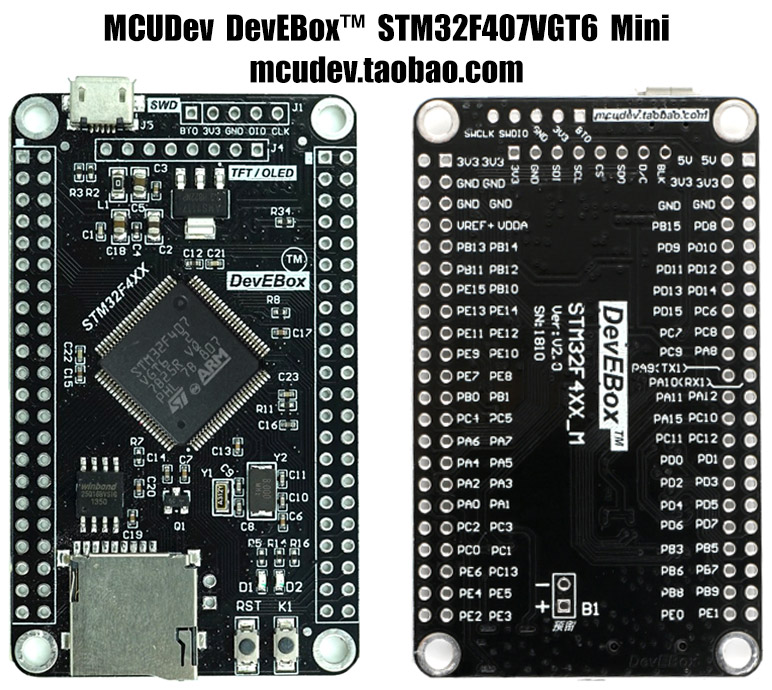

# MCUDev DevEBox STM32F407VGT6

MicroPython board definition files for the MCUDev black STM32F407VGT6 mini dev board.

**Markings:** DevEBox STM32F4XX_M Ver:V2.0 SN:1810



You can buy one for around $13 AUD (Oct 2019) on [AliExpress].

### Build the firmware

Clone the board definitions to your [MicroPython](https://github.com/micropython/micropython) `ports/stm32/boards` folder.

```bash
cd micropython/ports/stm32/boards
git clone https://github.com/mcauser/MCUDEV_DEVEBOX_F407VGT6.git

cd ..
make BOARD=MCUDEV_DEVEBOX_F407VGT6
```

### Flashing via DFU

This board can be flashed using DFU. To put the board in DFU mode, disconnect
USB, set BOOT0 to ON by connecting pin BT0 to 3V3 and reconnect USB.

Now you can flash the board using USB with the command:

```bash
make BOARD=MCUDEV_DEVEBOX_F407VGT6 deploy
```

Once the upload is complete, disconnect USB, set BOOT0 to OFF by connecting
pin BT0 to GND and reconnect USB.

Alternatively, you can use the MicroPython command `pyb.bootloader()`
to get into DFU mode without needing to use the switch.

Currently, you need to unplug and replug the board in order to switch from DFU
mode back to regular mode.

### Accessing the board

Once built and deployed, you can access the MicroPython REPL (the Python prompt) via USB serial.

```bash
screen /dev/tty.usbmodem1422 115200
# or
screen /dev/ttyACM0 115200
```

### Specifications

* STM32F407VGT6 ARM Cortex M4
* 168MHz, 210 DMIPS / 1.25 DMIPS / MHz
* 1.8V - 3.6V operating voltage
* 8MHz system crystal
* 32.768KHz RTC crystal
* 2.54mm pitch pins
* SWD header
* 1 MByte Flash, 192 + 4 KByte SRAM
* 3x SPI, 3x USART, 2x UART, 2x I2S, 3x I2C
* 1x FSMC, 1x SDIO, 2x CAN
* 1x USB 2.0 FS / HS controller (with dedicated DMA)
* 1x USB HS ULPI (for external USB HS PHY)
* Micro SD
* Winbond W25Q16 16Mbit SPI Flash
* 1x 10/100 Ethernet MAC
* 1x 8 to 12-bit Parallel Camera interface
* 3x ADC (12-bit / 16-channel)
* 2x DAC (12-bit)
* 12x general timers, 2x advanced timers
* AMS1117-3.3V: 3.3V LDO voltage regulator, max current 800mA
* Micro USB for power and comms
* Power LED D1
* User LED D2 (PA1) active low
* Reset button, 1x user buttons K0
* 2x22 side header
* SPI TFT/OLED header (3V3, GND, MOSI, SCK, CS, MISO, RST, BL)
* RTC battery header B1 beside SD card
* M3 mounting holes
* Dimensions: 40.89mm x 68.59mm

### Exposed Port Pins

* PA0-PA15
* PB0-PB3, PB5-PB15 (PB4 SPI1_MISO used exclusively with SPI Flash)
* PC0-PC13 (PC14 OSC32_IN and PC15 OSC32_OUT not broken out)
* PD0-PD15
* PE0-PE15

### Peripherals

#### TFT/OLED (J4)

* 1 3V3
* 2 GND
* 3 PB15 MOSI
* 4 PB13 SCK
* 5 PB12 CS
* 6 PB14 MISO
* 7 PC5 RS
* 8 PB1 BLK

#### SPI Flash W25Q16 (U3)

* 1 PA15 F_CS
* 2 PB4 SPI1_MISO
* 3 WP 3V3
* 4 GND
* 5 PB5 SPI1_MOSI
* 6 PB3 SPI1_SCK
* 7 HOLD 3V3
* 8 VCC 3V3

#### SWD debug (J1)

* 1 Boot0
* 2 3V3
* 3 GND
* 4 PA13 SWDIO
* 5 PA14 SWCLK

#### USB (J5)

* 1 VCC 5V
* 2 PA11 USB_DM
* 3 PA12 USB_DP
* 4 NC ID
* 5 GND

#### Micro SD (U5)

* 1 PC10 SDIO_D2
* 2 PC11 SDIO_D3
* 3 PD2 SDIO_CMD
* 4 3V3
* 5 PC12 SDIO_SCK
* 6 GND
* 7 PC8 SDIO_D0
* 8 PC9 SDIO_D1
* 9 NC SD_NC

#### User Button (K1)

* PA0 WK_UP

#### User LED (D2)

* PA1

#### Battery (B1)

* 1 BAT54C
* 2 GND

### Links

* [STM32F407VG on st.com](https://www.st.com/content/st_com/en/products/microcontrollers-microprocessors/stm32-32-bit-arm-cortex-mcus/stm32-high-performance-mcus/stm32f4-series/stm32f407-417/stm32f407vg.html)
* Buy on [AliExpress] or search for "STM32F407VGT6"
* Buy on [Taobao](https://item.taobao.com/item.htm?id=582677940441)
* [STM32F407VGT6 schematics](https://github.com/mcauser/MCUDEV_DEVEBOX_F407VGT6/blob/master/docs/STM32F407VX_M_schematics.pdf)

### Related boards

* [MCUDev Black STM32F407VET6](https://github.com/mcauser/BLACK_F407VE)
* [MCUDev Black STM32F407ZET6](https://github.com/mcauser/BLACK_F407ZE)
* [MCUDev Black STM32F407ZGT6](https://github.com/mcauser/BLACK_F407ZG)
* [MCUDev DevEBox STM32F407VET6](https://github.com/mcauser/MCUDEV_DEVEBOX_F407VET6)
* [MCUDev DevEBox STM32F407VGT6](https://github.com/mcauser/MCUDEV_DEVEBOX_F407VGT6) - this board
* [VCC GND STM32F407VET6 Mini](https://github.com/mcauser/VCC_GND_F407VE)
* [VCC GND STM32F407ZGT6 Mini](https://github.com/mcauser/VCC_GND_F407ZG)

[AliExpress]: https://www.aliexpress.com/item/32985219862.html

## License

Licensed under the [MIT License](http://opensource.org/licenses/MIT).
